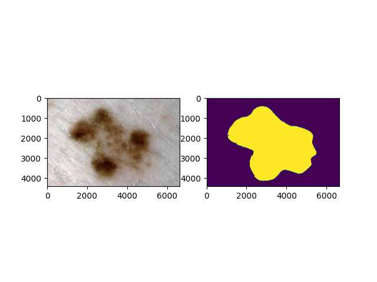

# U-Net Test

This project is just for testing the feasibility of U-Net.

Using dataset: ISIC-2017.

Here is my dataset directory structure:
```
ISIC_2017_Task_1
│  ├─ISIC-2017_Test_v2_Data
│  ├─ISIC-2017_Test_v2_Part1_GroundTruth
│  ├─ISIC-2017_Training_Data
│  ├─ISIC-2017_Training_Part1_GroundTruth
│  ├─ISIC-2017_Validation_Data
│  └─ISIC-2017_Validation_Part1_GroundTruth
```

U-Net original paper:
> https://arxiv.org/abs/1505.04597

U-Net model code is from: 
> https://github.com/milesial/Pytorch-UNet

Here's my result:

